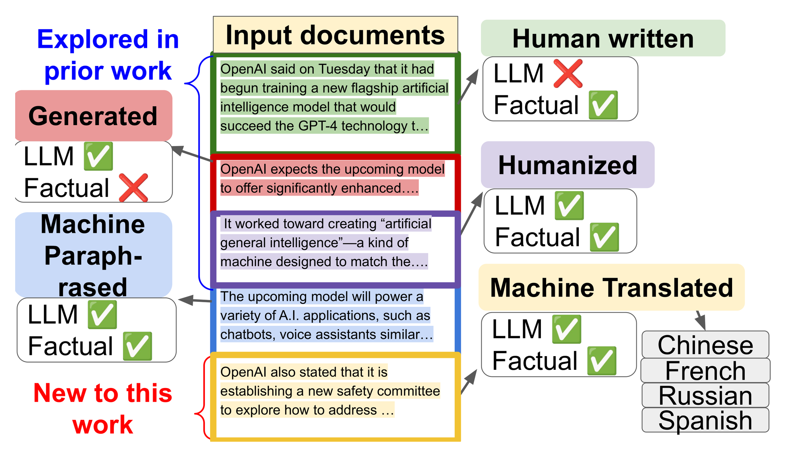

# HERO

Code for **Real, Fake, or Manipulated? Detecting Machine-Influenced Text** (Findings of EMNLP 2025) —
[arXiv:2509.15350](https://arxiv.org/abs/2509.15350).

<p align="center">
  
</p>

HERO (HiErarchical, length-RObust machine-influenced text detector) classifies a document into eight
fine-grained categories: human-written, machine-generated, machine-paraphrased, machine-humanized, and
machine-translated from Chinese, French, Spanish or Russian. It combines:

- **Subcategory Guidance** — extra cross-entropy terms over the logits of easily confused categories
  (generated vs. humanized, and the four translation source languages), computed only on samples from
  those categories: `L_total = L_CE + λ (L_GH + L_Trans)`. The guidance adds no parameters and no test-time cost.
- **Length specialists** — separate detectors trained with a maximum input length of 128, 256 and 512
  tokens, each with length cropping (with probability `p_crop` a training document is cropped to a
  shorter length).

> This release contains the **training code**. Evaluation code, data and checkpoints will follow.

## Repository structure

```
HERO/
├── hero/                       # the HERO package
│   ├── train.py                # training entry point (Hydra)
│   ├── config/                 # Hydra configs
│   │   ├── base.yaml           # global settings: classes, max_length, output dirs
│   │   ├── data/               # training data + length cropping
│   │   ├── model/              # encoder backbones
│   │   ├── loss/               # Subcategory Guidance (λ, groups)
│   │   ├── trainer/            # optimizer, epochs, batch size
│   │   └── exp/                # experiments: hero/specialist_{128,256,512}, baselines/*
│   ├── data/                   # dataset, labels, length-cropping collator
│   ├── data_process/           # convert raw generation outputs to HERO JSONL
│   ├── modules/                # detector model
│   ├── losses/                 # Subcategory Guidance loss
│   ├── trainer/                # training loop
│   ├── utils/                  # seeding, metrics
│   ├── scripts/                # launch scripts
│   └── tests/
├── media/                      # figures
├── install_scripts/
├── check_environment.py
└── pyproject.toml              # tooling configuration (black / isort / ruff)
```

## Installation

```bash
bash install_scripts/install_hero.sh      # creates a conda env "hero" and installs the package
# or
pip install -e hero/
```

## Data format

Training data is JSON Lines, one sample per line:

```json
{"id": "5a57...:paraphrased", "source_id": "5a57...", "text": "...", "label": "paraphrased",
 "generator": "Meta-Llama-3-8B-Instruct", "dataset": "goodnews", "split": "train"}
```

`label` is one of `human`, `generated`, `paraphrased`, `humanized`, `translated_zh`, `translated_fr`,
`translated_es`, `translated_ru`. `source_id` is the human-written article a sample was derived from;
the train/validation split is done by `source_id` so that no article appears in both.

Raw generation outputs (JSON dicts keyed by article id) can be converted with:

```bash
python -m hero.data_process.convert_raw \
    --dataset goodnews --split train --generator Meta-Llama-3-8B-Instruct \
    --generate-paraphrase-files raw/goodnews_train-generate_paraphrase-*.json \
    --humanize-files raw/goodnews_train-humanize-*.json \
    --translate-files raw/goodnews_train-translate-*.json \
    --output data/goodnews/train/Meta-Llama-3-8B-Instruct.jsonl
```

By default the training data is read from `data/` (set `HERO_DATA_ROOT` or `data.root=...` to change it).

## Training

Train the three HERO length specialists:

```bash
bash hero/scripts/train_specialists.sh
# or, with Hydra multirun
python hero/train.py -m +exp=hero/specialist_128,hero/specialist_256,hero/specialist_512
```

Train a single specialist, or a fine-tuned baseline:

```bash
python hero/train.py +exp=hero/specialist_512
python hero/train.py +exp=baselines/distilbert        # also: llm_detectaive, openai_d_large, chatgpt_d
```

Any config value can be overridden from the command line, e.g.

```bash
python hero/train.py +exp=hero/specialist_256 loss.weight=0.1 data.crop.p=0.0 seed=1
```

Training on a subset of translation languages (Fig. 5) is done by removing classes:

```bash
python hero/train.py +exp=hero/specialist_512 \
    'classes=[human,generated,paraphrased,translated_zh,humanized,translated_fr]'
```

Default hyperparameters (paper setting): DistilBERT backbone, Adam with learning rate `1e-5` (halved when
validation mAP stops improving), 3 epochs, batch size 3, `λ = 0.01`, `p_crop = 0.2`. Each run writes
`config.yaml`, `train.log`, `metrics.jsonl`, `best.pt` (highest validation mAP) and `last.pt` to
`logs/<experiment_name>-<timestamp>/`.

## Citation

```bibtex
@inproceedings{wang2025hero,
  title     = {Real, Fake, or Manipulated? Detecting Machine-Influenced Text},
  author    = {Wang, Yitong and Zhang, Zhongping and Piana, Margherita and Zhou, Zheng and Gerstoft, Peter and Plummer, Bryan A.},
  booktitle = {Findings of the Association for Computational Linguistics: EMNLP 2025},
  year      = {2025}
}
```
